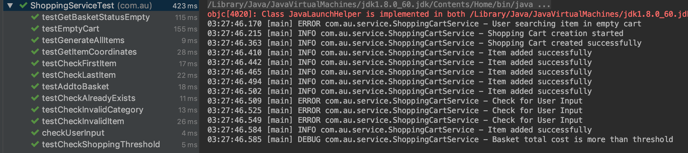
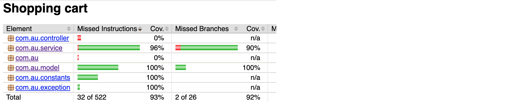
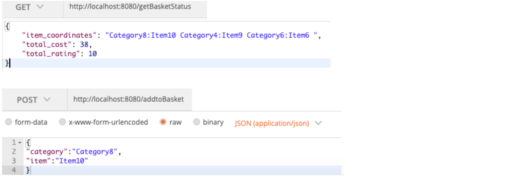
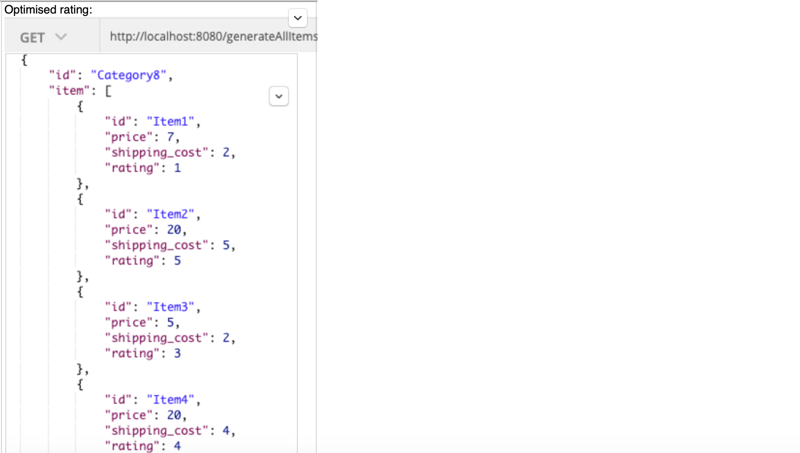

Shopping Cart - Basket filler
===============
# Introduction
Imagine you have a basket. Your objective is to fill this basket with as many items as you can.
However, there are 20 categories of items and you may only pick 1 item from each category. Each
item has a price, a shipping cost and a rating.

At the end: This code prints the coordinates of the selected items.
e.g. – CategoryA:ItemX,CategoryB:ItemY, ….
• Total cost, and
• Sum of ratings of all the items that were picked.                                        

# Table of Contents

* [Installation](#installation)
* [Prerequisites](#prerequisites)    
* [Run](#run)

# Installation
No initial setup is required

# Prerequisites
* java >= 1.8
* maven 3.6.1

# Requirements
Implemented and tested using Java 8 
Tests require JUnit and Mockito 
Project dependencies and compiling managed by Maven

# Run:
Set configuration for ShoppingCart(main) class

# Additional Enhancements

Implement authentication and session state
Sort coordinates based on categories/price/rating
Can be implemented with Crud repositories

# Test Cases Executed

# Code Coverage 90%

# Testing using Postman

    
